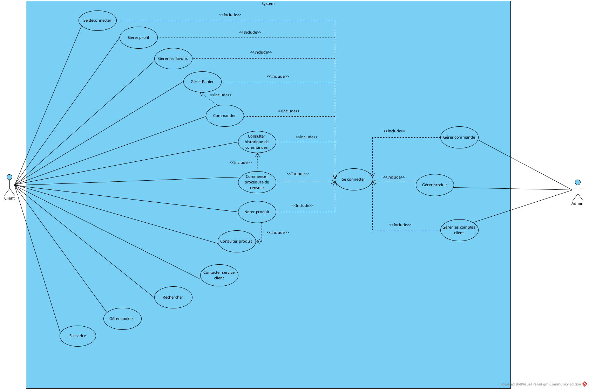
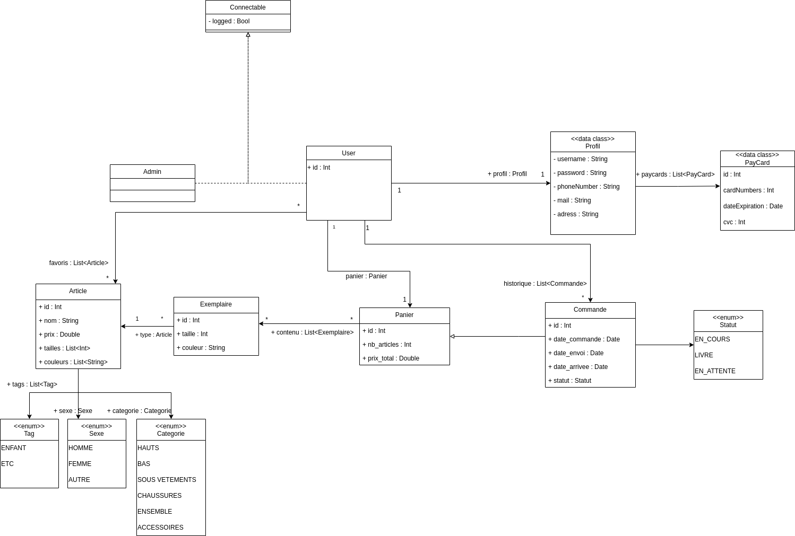
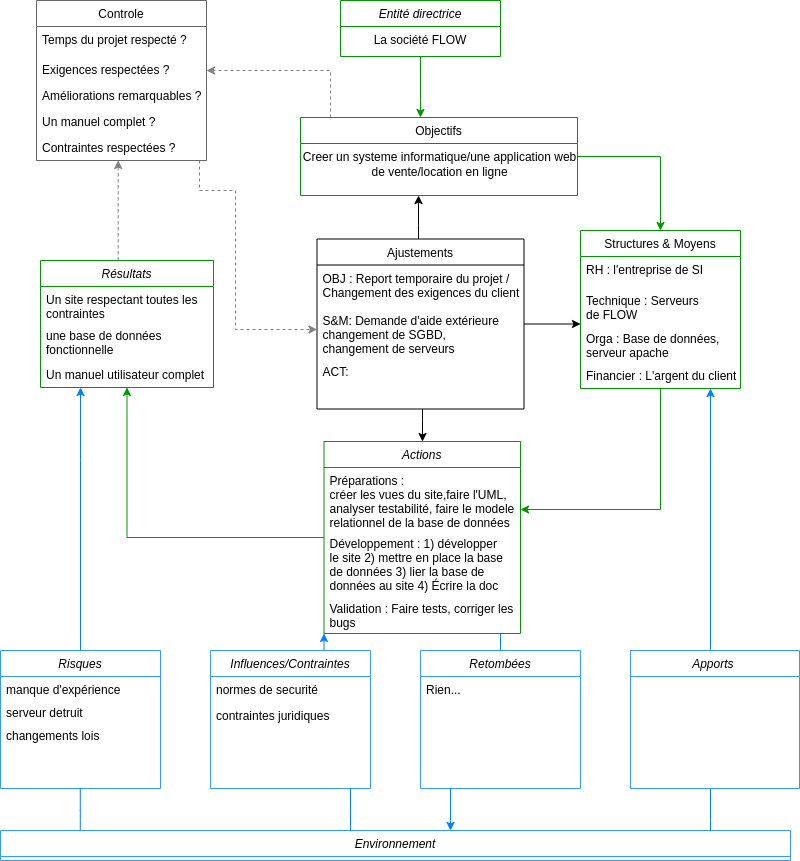
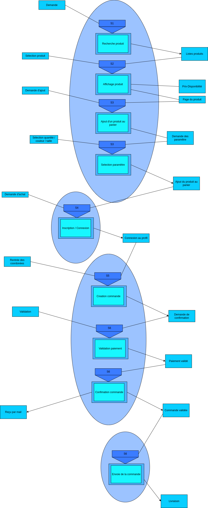
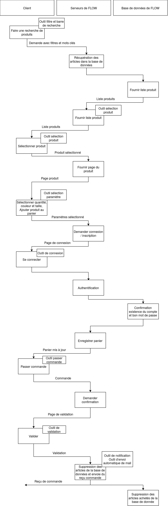

# eq_02_03_AHAMADA-Ibrahim_CHOCHO-David_FREMONT-Tom_MARY-Bastian

Vous disposez d'une VM avec apache2, php 8.2,  mariaDB 10.1 
La VM dispose de trois comptes root, user et sql, root et user disposent d'un accès en ssh et sql uniquement en sftp
Le SGBD dispose du compte user avec comme mot de passe pass et du compte sql avec comme mot de passe sql

Sur l'OS root et user ont le même mot de passe (ip, password) :
172.26.82.23
KfwHo4cF

Le SGBD utilisé est mariadb il possède pour l'instant un user : login=admin password=password

Lien vers le google drive : https://docs.google.com/document/d/1tPmKocQxH4bKT6cpVneKpG9Sw1pR8x_hG3ldjQbS648/edit

Pour accéder à la vm faire : ssh root|user@172.26.82.23
ensuite aller dans /var/www/html
et executer ./tests/prepareForProd.sh

## R3.03 | Analyse

## Exigences

## Perimètre

## Besoins

### Fonctionnels

### Non-fonctionnels

## Diagramme de cas d'utilisation

## Diagrammes de séquences

## Modèle du domaine

## Diagramme de classes participantes

## Diagramme de classes d'analyse

## R3.10 | Management des systèmes d’information

## Note de cadrage

### Définition du projet

Un site proposant un système d’abonnement aux clients, leur permettant de commander une fois par mois des vêtements pour un mois, avec possibilité de garder les vêtements en les payant. Les ensembles sont assemblés de manière à ce qu'ils soient cohérents et qu’ils correspondent au clients.

### Origine du projet / contexte

La société FLOW souhaite une refonte de son système d’information (SI) et l’automatisation d’une partie du SI, avec principalement la création d’un site (ou application) de présentation et de ventes de produits en lignes.   
Le site devra être hébergé sur des serveurs. La société sera responsable des serveurs et du déploiement de l’application sur ces derniers.  
L’ensemble devra répondre aux contraintes de sécurité, de performance et aux aspects juridiques sur la protection des données.

### Objectifs du projet

Créer un site de vente/location de vêtement en ligne répondant aux exigences attendues du clients.  
Mise en place de méthodes pour montrer que l’application fait bien ce qu’elle doit faire et pour montrer qu’elle est efficace en temps d’exécution et en mémoire.  
Mise en place de la base de donnée.  
Créer une documentation complète du SI.  
Administrer le serveur et déployer l’application.  
Rédiger en anglais une liste des mesures mises en place.  

### Périmètre du projet

Conception du site web, de la base de données, du réseau et de la documentation. Les serveurs et leur maintenance ne fait pas partie du 
projet.

### Contraintes

Délai de 3 mois pour le projet  
Sécurité  
Performances  
Protection des données  

### Acteurs

L’entreprise FLOW  
Notre équipe  

### Macro Planning

Semaine 1-4: Analyse des besoins/exigences, note cadrage, diagramme de séquence et de cas d’utilisation et analyse systémique.  
Semaine 5-7: Figma  

### Ressources

Les serveurs de FLOW.  

### Communication

La communication sur l’avancement du projet se fera hebdomadairement avec la société à l’aide de réunions en ligne sur Zoom.  

### Risques

Possibles retards dans la création du site web.  
Exigences non respectées.  
Changement d’exigence de la part du client.  
Risque juridique.  
Faille dans la sécurité.  
Performances de l’application web trop faibles.  
Bugs dans le code.  

## Analyse systémique

## Modèle de processus

## Modèle organisationnel

